# 🔐 Classical Cipher Security Analyzer

> A Python-based educational cryptanalysis and security analysis toolkit for classical ciphers, featuring automated cipher detection, statistical analysis, candidate key recovery, and security report generation.

## 🚀 Project Overview

The **Classical Cipher Security Analyzer** is a Python-based security analysis toolkit developed to demonstrate practical cryptographic operations and classical cryptanalysis techniques.

The project provides an interactive **CIPHER//COMMAND CENTER** dashboard for performing encryption, decryption, statistical analysis, automated cipher detection, recovery operations, and security reporting.

The toolkit focuses on two classical cipher families:

- **Caesar Cipher**
- **Vigenère Cipher**

It combines traditional cryptographic techniques with statistical analysis to assist in analyzing unknown ciphertexts.

## 🎯 Objectives

- Implement Caesar cipher encryption and decryption.
- Implement Vigenère cipher encryption and decryption.
- Perform frequency analysis on ciphertext.
- Analyze possible Vigenère key lengths.
- Perform automated Caesar cipher analysis.
- Search for candidate Vigenère keys.
- Automatically detect likely cipher types.
- Generate security analysis reports.
- Provide an interactive security-oriented dashboard.
- Demonstrate the importance of validating statistical recovery results.

## 🖥️ CIPHER//COMMAND CENTER

The project includes an interactive dashboard called **CIPHER//COMMAND CENTER**.

It provides a centralized interface for:

- Cipher selection
- Encryption and decryption
- Plaintext/ciphertext input
- Result analysis
- Frequency monitoring
- Caesar analysis
- Vigenère recovery
- Key-length analysis
- Automatic cipher detection
- Result saving
- Security report generation
- System and audit information

### Main Dashboard

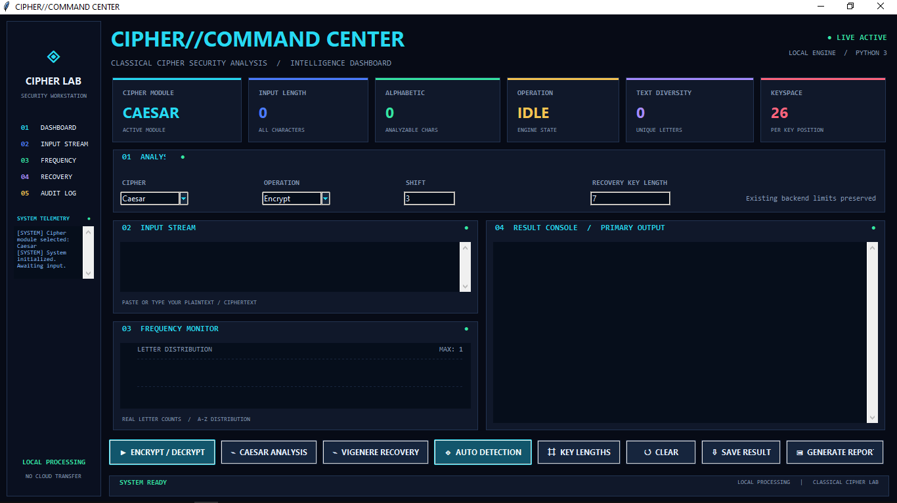

## 🔎 Core Capabilities

### 1. Caesar Cipher

The analyzer supports:

- Caesar encryption
- Caesar decryption
- Shift-based operations
- Brute-force analysis
- Statistical shift estimation

**Analysis workflow:**

Ciphertext → Statistical Analysis → Candidate Shift → Decryption → Result Validation

### 2. Vigenère Cipher

The toolkit supports:

- Vigenère encryption
- Vigenère decryption
- Key-based operations
- Key-length analysis
- Candidate key recovery

The recovery process uses statistical techniques to generate possible candidates rather than assuming that a single result is always correct.

### 3. Frequency Analysis

The analyzer monitors alphabetic character distributions within the input.

This can assist with:

- Classical substitution analysis
- Caesar shift estimation
- Ciphertext characteristics
- Statistical comparison

The frequency monitor is integrated directly into the dashboard.

### 4. Vigenère Key-Length Analysis

The project includes statistical analysis for estimating possible Vigenère key lengths.

The analysis uses characteristics such as the **Index of Coincidence (IoC)** to identify candidate key lengths.

These candidates can then be used during recovery analysis.

### 5. Automatic Cipher Detection

The analyzer provides an automated detection workflow that evaluates ciphertext characteristics and attempts to identify whether the input is more consistent with supported cipher types.

The result is intended as an analytical indication and should be validated rather than treated as guaranteed identification.

### 6. Automated Recovery

The project includes automated analysis and recovery functionality for supported classical ciphers.

The recovery process can:

1. Analyze the ciphertext.
2. Estimate useful statistical characteristics.
3. Generate candidate shifts or keys.
4. Produce candidate plaintext.
5. Allow the analyst to validate the recovered result.

**Important:** Statistical recovery produces candidates that require validation.

### 7. Security Reporting

The project can generate security analysis reports in:

- HTML
- TXT
- JSON

The reports provide a record of analysis results and relevant security/audit information.

## 🏗️ Solution Architecture

**User Input**

↓

**CIPHER//COMMAND CENTER**

↓

**Caesar / Vigenère / Detection Modules**

↓

**Statistical Analysis**

↓

**Candidate Recovery**

↓

**Result Validation**

↓

**Security Report Generation**

## 🛠️ Technologies Used

| Technology | Purpose |
|---|---|
| Python | Core implementation |
| Tkinter | Interactive desktop GUI |
| wordfreq | Language-frequency and word analysis |
| Statistical analysis | Cryptanalysis and recovery |
| HTML | Security report generation |
| JSON | Structured report/output data |
| TXT | Text-based reporting |

## 📂 Project Structure

The repository is organized into:

- `src/` — Python source code
- `screenshots/` — Project evidence and demonstrations
- `README.md` — Project documentation
- `requirements.txt` — Python dependencies
- `.gitignore` — Files excluded from version control

The main source modules include:

- `analysis.py`
- `caesar.py`
- `detector.py`
- `gui.py`
- `main.py`
- `security_reporting.py`
- `vigenere.py`
- `vigenere_attack.py`
- `vigenere_auto.py`

## ⚙️ Installation

### 1. Clone the repository

`git clone https://github.com/pranavkundap2004-stack/classical-cipher-security-analyzer.git`

### 2. Enter the project directory

`cd classical-cipher-security-analyzer`

### 3. Install dependencies

`pip install -r requirements.txt`

### 4. Launch the dashboard

`python src/gui.py`

## 📦 Requirements

The project primarily uses Python's standard library.

The external dependency is:

`wordfreq`

It can also be installed manually using:

`pip install wordfreq`

Tkinter is normally included with standard Python installations on Windows. Linux distributions may require their package manager's Tkinter package.

## ▶️ Usage

### GUI Mode

Launch the main dashboard using:

`python src/gui.py`

The **CIPHER//COMMAND CENTER** provides access to the major analysis functions through the graphical interface.

### CLI Mode

The project also contains `src/main.py`, which provides the console-oriented workflow.

## 📸 Evidence & Demonstrations

### Caesar Encryption

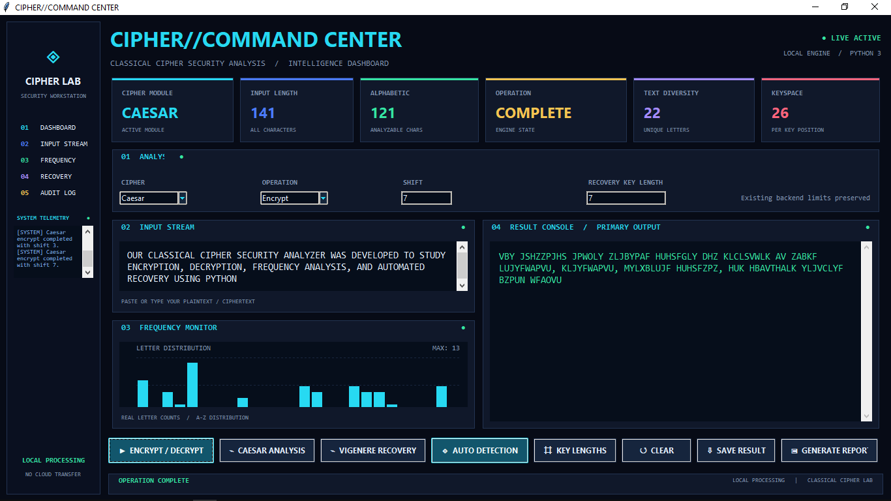

### Caesar Decryption

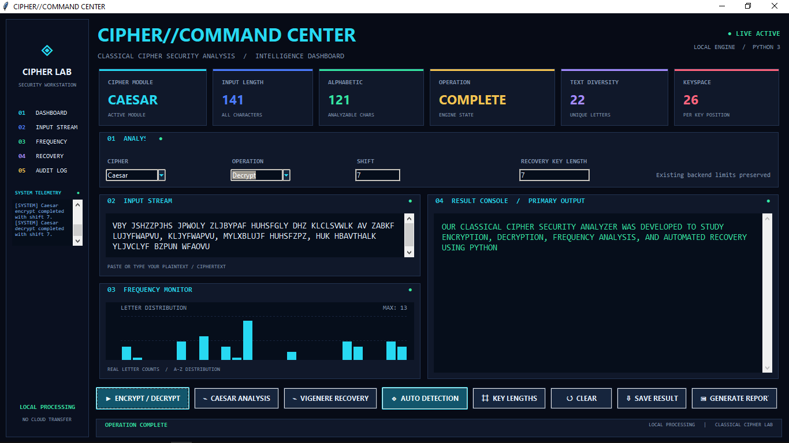

### Vigenère Encryption

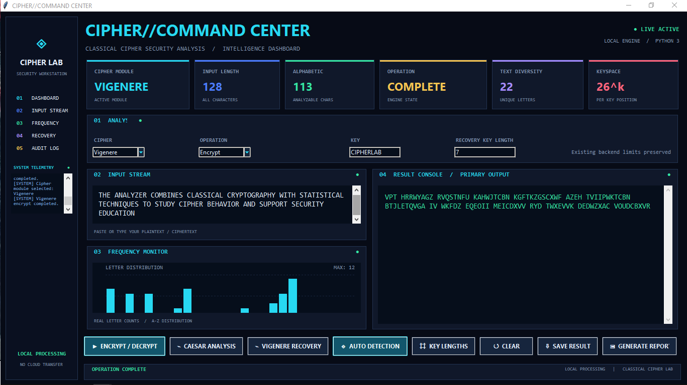

### Vigenère Decryption

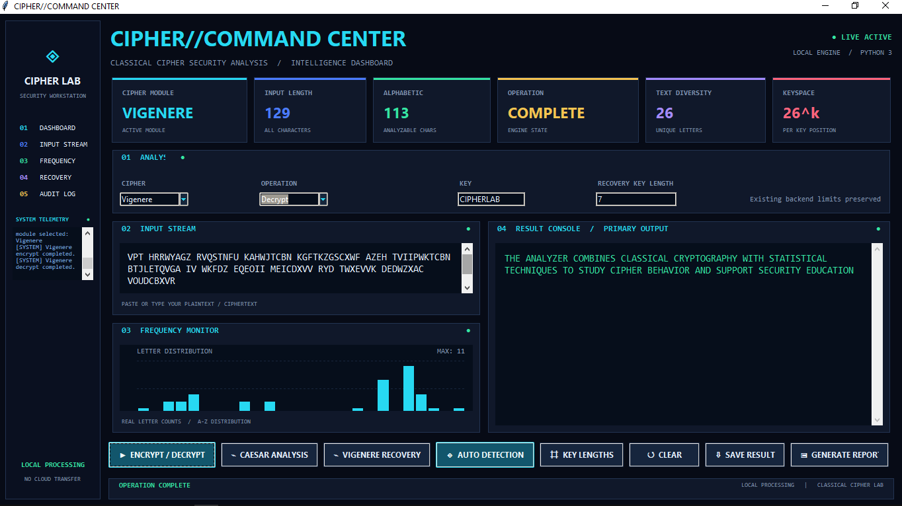

### Frequency Monitor

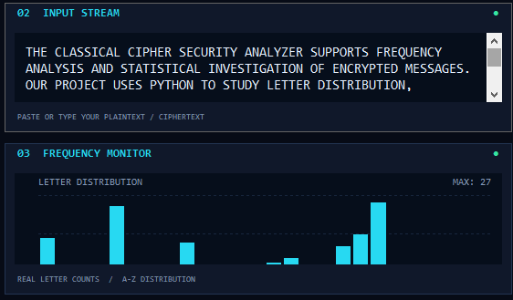

### Automatic Caesar Analysis

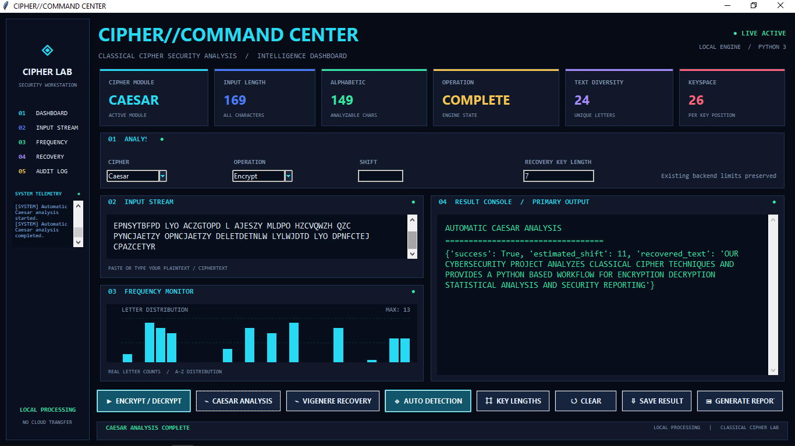

### Vigenère Key-Length Analysis

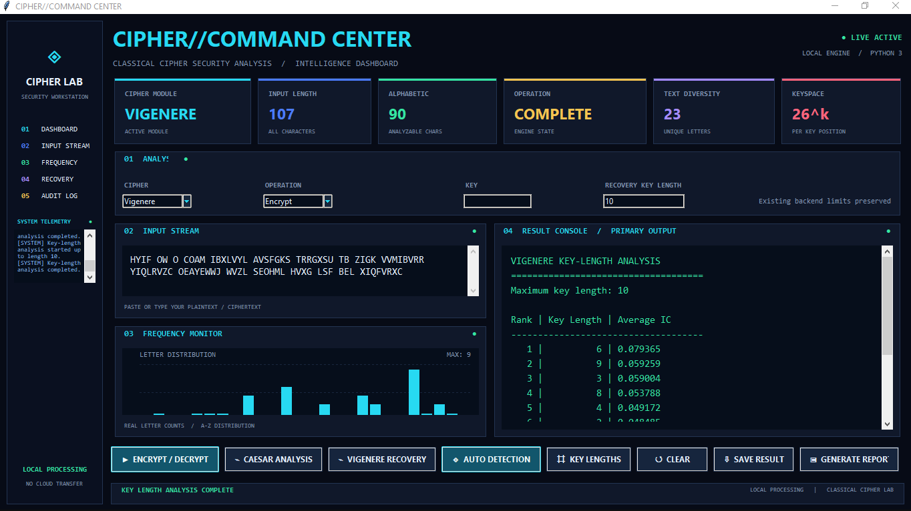

### Automatic Vigenère Key Recovery

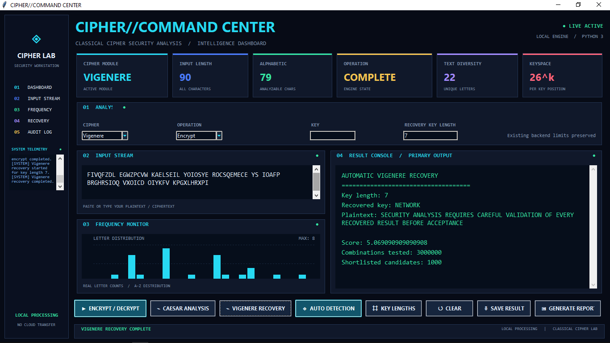

### Automatic Cipher Detection

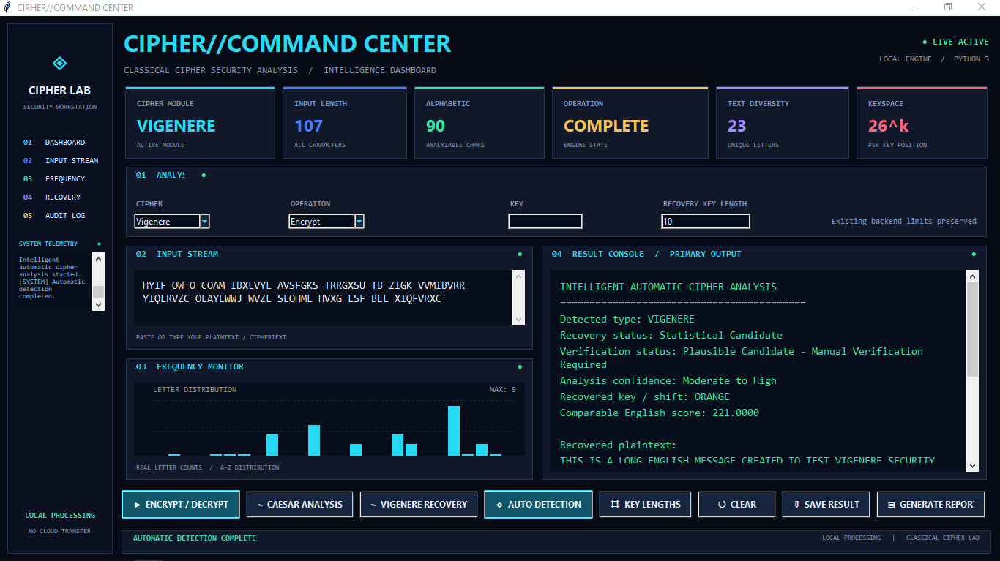

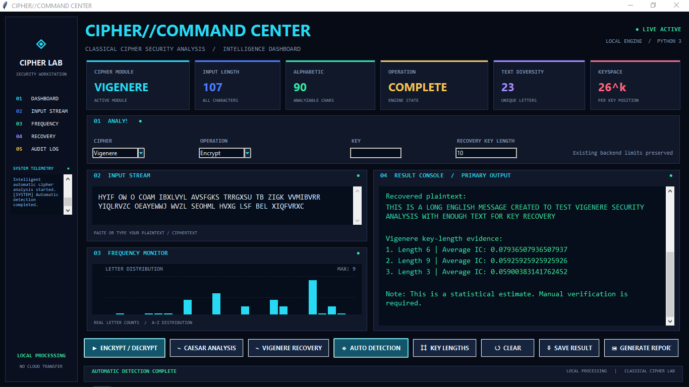

### Security Report Generation

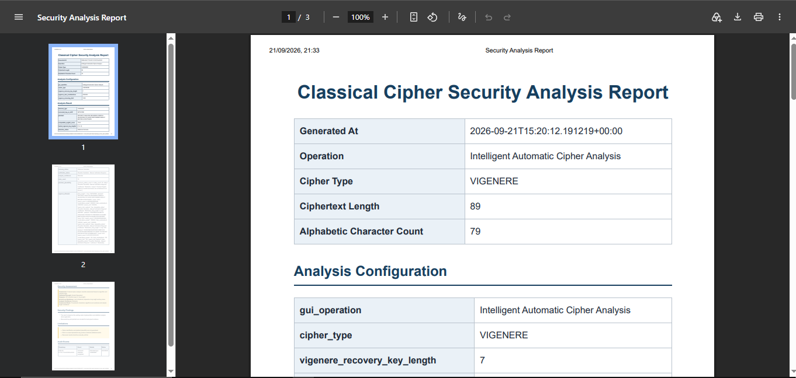

## 🧪 Testing & Validation

The project was tested using controlled plaintext and ciphertext examples across the implemented modules.

Testing covered:

- Caesar encryption
- Caesar decryption
- Caesar statistical analysis
- Vigenère encryption
- Vigenère decryption
- Frequency monitoring
- Vigenère key-length analysis
- Automated Vigenère recovery
- Automatic cipher detection
- Security report generation

Recovered results were reviewed for correctness rather than assuming that statistical candidates were automatically valid.

## ⚠️ Limitations

Classical cryptanalysis techniques are dependent on the characteristics of the ciphertext.

Important limitations include:

- Very short ciphertexts may not contain enough statistical information.
- Frequency-based analysis becomes less reliable with limited samples.
- Automated recovery can produce multiple candidate results.
- Candidate plaintext should be manually validated.
- The toolkit is designed for educational and analytical purposes.
- It is not intended to represent modern cryptographic security systems.

## 🔮 Future Scope

Potential improvements include:

- Additional classical cipher algorithms
- Improved language models
- Larger candidate search spaces
- Multi-language frequency analysis
- More advanced scoring methods
- Expanded file-processing capabilities
- Additional visualization options
- Web-based interface
- Extended audit and reporting features
- Support for additional cryptanalysis techniques

## 🎓 Learning Outcomes

This project provided practical experience with:

- Python application development
- Cryptographic algorithms
- Classical cryptanalysis
- Frequency analysis
- Statistical reasoning
- Automated detection
- Candidate key recovery
- GUI development using Tkinter
- Security reporting
- Software testing and validation
- Technical documentation

## 🔐 Security Perspective

Although Caesar and Vigenère are historical cipher systems, analyzing them provides useful foundations for understanding:

- Ciphertext characteristics
- Key spaces
- Frequency distributions
- Statistical attacks
- Cryptanalysis workflows
- Automated security analysis
- The importance of validating analytical results

The project is intended as an educational security analysis tool and should not be considered a replacement for modern cryptographic algorithms.

## 👨‍💻 Author

**Pranav Kundap**

Cybersecurity | Python | Cryptography | Security Analysis

GitHub: https://github.com/pranavkundap2004-stack

## 📜 Project Context

This project was developed as part of a cybersecurity internship project with **Labmentix**.

The implementation focuses on demonstrating practical cybersecurity concepts through a functional Python-based cryptanalysis toolkit.

---

⭐ If you find this project useful for learning about classical cryptography and cryptanalysis, consider giving the repository a star.
